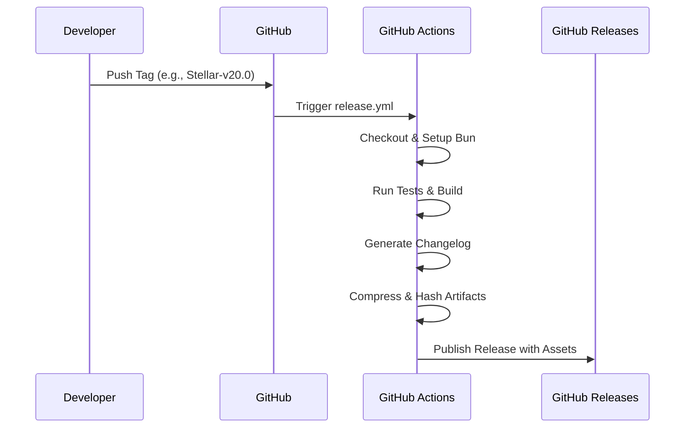

# Release Process

This document describes the automated workflow for publishing new versions of BMI Stellar. It covers the full lifecycle — from code integrity verification through tagging, CI pipeline execution, and post-release integrity checks.

## Table of Contents

- [Automated Release Workflow](#automated-release-workflow)
- [Step-by-Step Release Guide](#step-by-step-release-guide)
- [Release Package Contents](#release-package-contents)
- [Changelog Generation](#changelog-generation)
- [Verifying Package Integrity](#verifying-package-integrity)
- [Version Naming Conventions](#version-naming-conventions)
- [Rollback Procedure](#rollback-procedure)
- [Troubleshooting](#troubleshooting)

---

## Automated Release Workflow

When a new tag is pushed, GitHub Actions handles the entire release lifecycle:



## Step-by-Step Release Guide

### 1. Verify Code Integrity

Confirm all changes are committed, tested, and pushed to the `dev` branch. Run the full verification suite:

```bash
bun run verify
```

> [!NOTE]
> The `verify` command runs `format:check + check + lint + test:run + build`. The build step will fail on Node 24 due to the Vercel adapter — this is a known issue and does not block the release on CI (which uses Node 22).

### 2. Update Version Strings

Use the canonical update script to synchronize the version across `package.json`, `README.md`, `LICENSE.md`, and backup metadata:

```bash
# Preview changes before applying
bun run bmi-update-version --dry-run 20.1.0

# Apply the version update
bun run bmi-update-version 20.1.0

# Commit the version change
git add -A
git commit -m "chore: prepare for release Stellar-v20.1"
git push origin dev
```

### 3. Merge to Main

```bash
git checkout main
git merge dev
git push origin main
```

### 4. Create and Push the Tag

Tags must follow the `Stellar-v<major>.<minor>` format:

```bash
git tag Stellar-v20.1
git push origin Stellar-v20.1
```

### 5. Verify the Pipeline

After pushing the tag:

1. Navigate to the **Actions** tab in the repository.
2. Confirm the `release.yml` workflow was triggered.
3. Monitor the build, test, and packaging steps.
4. Verify the GitHub Release was published with all assets.

## Release Package Contents

The generated distribution package includes:

- `build/` — The production-ready SvelteKit application bundle.
- `package.json` — Precise project metadata with resolved version.
- `README.md` — Core documentation.
- `LICENSE.md` — The GPL-3.0 License.

## Changelog Generation

Changelogs are auto-generated based on conventional commits:

- **Initial Release:** Compiles all commits up to the tag.
- **Subsequent Releases:** Compiles commits between the new tag and the immediate predecessor tag.

The changelog is included in the GitHub Release body.

## Verifying Package Integrity

Each release includes a SHA-256 cryptographic checksum. Users can verify their downloads:

```bash
sha256sum -c bmi-stellar-edition-{version}.zip.sha256
```

## Version Naming Conventions

We adhere to Semantic Versioning principles with a project-specific tag prefix:

| Format          | Example                          | Use Case                                                          |
| --------------- | -------------------------------- | ----------------------------------------------------------------- |
| **Major**       | `Stellar-v20.0`, `Stellar-v21.0` | Monumental feature additions or breaking architectural changes    |
| **Minor**       | `Stellar-v20.1`, `Stellar-v20.2` | Backward-compatible feature additions                             |
| **Patch**       | `20.0.1`, `20.0.2`               | Backward-compatible bug fixes (package.json version only, no tag) |
| **Pre-release** | `Stellar-v21.0-beta1`            | Testing monumental changes before general availability            |

> [!IMPORTANT]
> The `Stellar-v` prefix is required on all release tags. The `package.json` version uses plain semver (e.g., `20.1.0`) without the prefix.

## Rollback Procedure

If a released version contains a critical regression:

1. **Fix forward** on `dev` — this is the preferred approach.
2. If a hotfix is needed directly on `main`:
   ```bash
   git checkout main
   git checkout -b hotfix/critical-fix
   # Apply the fix
   git commit -m "fix: critical regression in ..."
   git checkout main
   git merge hotfix/critical-fix
   git push origin main
   bun run bmi-update-version 20.0.1
   git tag Stellar-v20.0
   git push origin Stellar-v20.0
   ```
3. Merge the hotfix back to `dev`:
   ```bash
   git checkout dev
   git merge main
   git push origin dev
   ```

## Troubleshooting

### Pipeline Failures

1. Navigate to the **Actions** tab in the repository.
2. Select the failed workflow run.
3. Inspect the execution logs. Common culprits:
   - Failing tests (`bun test`)
   - Build errors (`bun run build`)
   - Version string mismatch (tag version != package.json version)

### Tagging Errors

If you pushed a tag prematurely:

```bash
# Delete the local tag
git tag -d Stellar-v20.1

# Delete the remote tag
git push origin :refs/tags/Stellar-v20.1

# Fix the code, then recreate and push the tag
git tag Stellar-v20.1
git push origin Stellar-v20.1
```

### Stale Lockfile

If the build fails due to dependency resolution issues:

```bash
rm bun.lock
bun install
git add bun.lock
git commit -m "chore: refresh lockfile"
```
