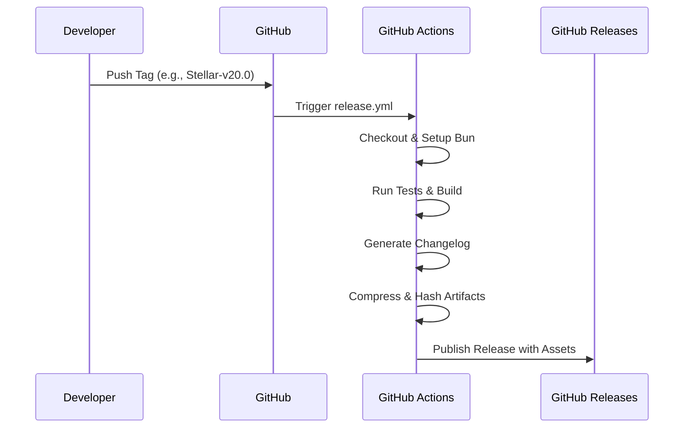

# 📦 Release Process Documentation

This document outlines the professional, automated workflow used to release new versions of BMI Stellar.

## 📑 Table of Contents

- [Automated Release Workflow](#-automated-release-workflow)
- [How to Create a Release](#-how-to-create-a-release)
- [Release Package Contents](#-release-package-contents)
- [Changelog Generation](#-changelog-generation)
- [Verifying Package Integrity](#-verifying-package-integrity)
- [Version Naming Conventions](#-version-naming-conventions)
- [Troubleshooting](#️-troubleshooting)

---

## 🚀 Automated Release Workflow

This project utilizes highly automated GitHub Actions to seamlessly generate, verify, and publish releases whenever a new tag is pushed.



## 🛠️ How to Create a Release

### 1. Ensure Code Integrity

Confirm all changes are committed, tested, and pushed to the `main` branch.

```bash
git add .
git commit -m "chore: prepare for release Stellar-v20.0"
git push origin main
```

### 2. Update Version Strings

> [!IMPORTANT]
> Run the canonical update script to sync `package.json` and other metadata.
> `bun run bmi-update-version 20.0.0`

### 3. Create and Push the Tag

```bash
# Create a new tag
git tag Stellar-v20.0

# Push the tag to trigger the pipeline
git push origin Stellar-v20.0
```

### 4. Pipeline Execution

Once the tag is pushed, GitHub Actions handles the rest:

1. ✅ Checks out the codebase.
2. ✅ Provisions the required Bun runtime.
3. ✅ Installs exact dependencies.
4. ✅ Builds the SvelteKit production bundle.
5. ✅ Generates a rich changelog.
6. ✅ Packages `bmi-stellar-edition-{version}.zip`.
7. ✅ Generates a SHA-256 cryptographic checksum.
8. ✅ Drafts and publishes the GitHub Release.

## 📋 Release Package Contents

The generated distribution package includes:

- `build/` - The production-ready application.
- `package.json` - Precise project metadata.
- `README.md` - Core documentation.
- `LICENSE.md` - The GPL-3.0 License.

## 🔍 Changelog Generation

Changelogs are auto-generated based on conventional commits.

- **Initial Release:** Compiles all commits up to the tag.
- **Subsequent Releases:** Intelligently compiles commits _between_ the new tag and the immediate predecessor tag.

## 🔒 Verifying Package Integrity

Security is paramount. Users can cryptographically verify their downloads using the provided checksum:

```bash
sha256sum -c bmi-stellar-edition-{version}.zip.sha256
```

## 🏷️ Version Naming Conventions

We adhere to Semantic Versioning principles:

| Format          | Example                          | Use Case                                                        |
| --------------- | -------------------------------- | --------------------------------------------------------------- |
| **Major**       | `Stellar-v20.0`, `Stellar-v21.0` | Monumental feature additions or breaking architectural changes. |
| **Minor**       | `Stellar-v20.1`, `Stellar-v20.2` | Backward-compatible feature additions.                          |
| **Patch**       | `20.0.1`, `20.0.2`               | Backward-compatible bug fixes.                                  |
| **Pre-release** | `3.0-beta1`                      | Testing monumental changes before general availability.         |

## ⚠️ Troubleshooting

### Pipeline Failures

If a release fails to publish:

1. Navigate to the **Actions** tab in the repository.
2. Select the failed workflow run.
3. Inspect the execution logs. Common culprits include failing tests (`bun test`) or build errors (`bun run build`).

### Tagging Errors

If you pushed a tag prematurely:

```bash
git tag -d Stellar-v20.0
git push origin :refs/tags/Stellar-v20.0
# Fix the code, then recreate and push the tag.
```
