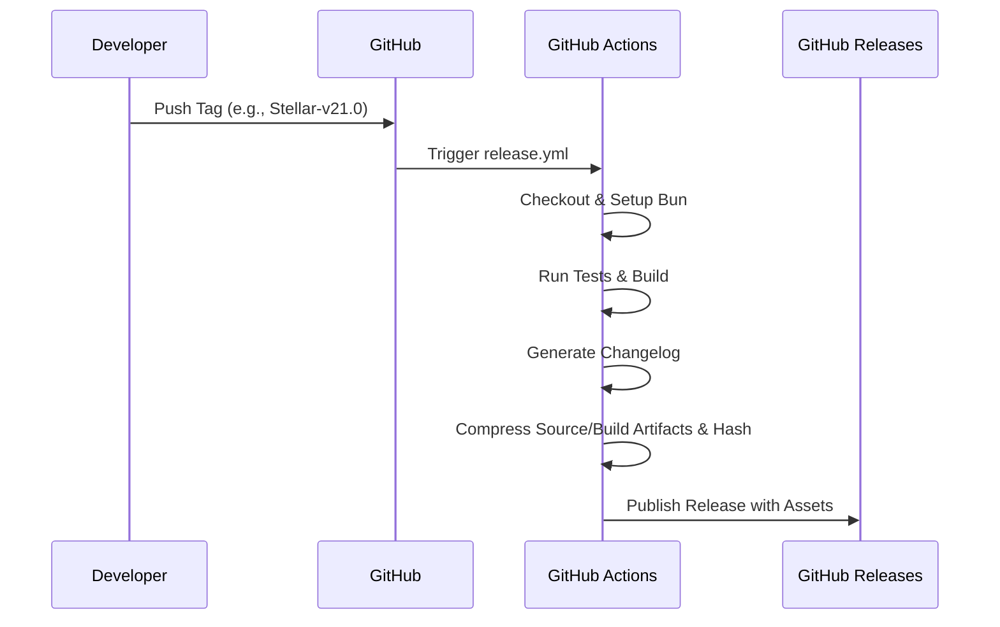

# Release Process

This document describes the release workflow for BMI Stellar. It covers the full lifecycle — code integrity verification, version synchronization, tag validation, GitHub Actions publishing, artifact checksums, and rollback decisions.

## Table of Contents

- [Automated Release Workflow](#automated-release-workflow)
- [Step-by-Step Release Guide](#step-by-step-release-guide)
- [Release Package Contents](#release-package-contents)
- [Changelog Generation](#changelog-generation)
- [Verifying Package Integrity](#verifying-package-integrity)
- [Version Naming Conventions](#version-naming-conventions)
- [Rollback Procedure](#rollback-procedure)
- [Troubleshooting](#troubleshooting)

---

## Automated Release Workflow

When a new tag is pushed, GitHub Actions handles the entire release lifecycle:



## Step-by-Step Release Guide

### 1. Verify Code Integrity

Confirm all changes are committed, tested, and pushed to the `dev` branch. Run the full verification suite locally:

```bash
bun run verify
```

> [!NOTE]
> The `verify` command runs `format:check + check + lint + test:run + build`. The project targets Node `>=22 <25`, and CI/release workflows currently run on Node 24.

### 2. Update Version Strings

Use the canonical update script to synchronize the version across `package.json`, `README.md`, and `DORMANT.md`:

```bash
# Preview changes before applying
bun run bmi-update-version --dry-run 21.0.0

# Apply the version update
bun run bmi-update-version 21.0.0

# Commit the version change
git add -A
git commit -m "chore: prepare for release Stellar-v21.0"
git push origin dev
```

### 3. Merge to Main

```bash
git checkout main
git merge dev
git push origin main
```

### 4. Create and Push the Tag

Tags must follow the `Stellar-v<major>.<minor>` format:

```bash
git tag Stellar-v21.0
git push origin Stellar-v21.0
```

The workflow validates that the tag's `<major>.<minor>` pair matches `package.json`. For example, `package.json` version `21.0.0` must be tagged as `Stellar-v21.0`.

### 5. Verify the Pipeline

After pushing the tag:

1. Navigate to the **Actions** tab in the repository.
2. Confirm the `release.yml` workflow was triggered.
3. Monitor the build, test, and packaging steps.
4. Verify the GitHub Release was published with all assets.

## Release Package Contents

Each release publishes two zip artifacts plus SHA-256 checksum files:

| Artifact                              | Contents                                                    |
| ------------------------------------- | ----------------------------------------------------------- |
| `bmi-stellar-source-{tag}.zip`        | Source, static assets, scripts, docs, configs, workflows    |
| `bmi-stellar-source-{tag}.zip.sha256` | SHA-256 checksum for the source archive                     |
| `bmi-stellar-build-{tag}.zip`         | Pre-built static `build/` output with core project metadata |
| `bmi-stellar-build-{tag}.zip.sha256`  | SHA-256 checksum for the build archive                      |

The release workflow builds the static package with `svelte.config.static.js` while keeping the repository's normal Vercel configuration intact.

## Changelog Generation

Changelogs are auto-generated based on conventional commits:

- **Initial Release:** Compiles all commits up to the tag.
- **Subsequent Releases:** Compiles commits between the new tag and the immediate predecessor tag.

The changelog is included in the GitHub Release body.

## Verifying Package Integrity

Each release includes a SHA-256 cryptographic checksum. Users can verify their downloads:

```bash
sha256sum -c bmi-stellar-source-Stellar-v21.0.zip.sha256
sha256sum -c bmi-stellar-build-Stellar-v21.0.zip.sha256
```

## Version Naming Conventions

We adhere to Semantic Versioning principles with a project-specific tag prefix:

| Format    | Example                          | Use Case                                                       |
| --------- | -------------------------------- | -------------------------------------------------------------- |
| **Major** | `Stellar-v21.0`, `Stellar-v22.0` | Major product milestones or broad architectural improvements   |
| **Minor** | `Stellar-v21.1`, `Stellar-v21.2` | Backward-compatible feature additions or polished release cuts |
| **Patch** | `21.0.1`, `21.0.2`               | Hotfix deploys tracked in `package.json`; no release tag       |

> [!IMPORTANT]
> The `Stellar-v` prefix is required on all release tags. The `package.json` version uses plain semver (for example, `21.0.0`) without the prefix.

## Rollback Procedure

If a released version contains a critical regression:

1. **Fix forward** on `dev` — this is the preferred approach.
2. If a hotfix is needed directly on `main`, keep the patch small and traceable:
   ```bash
   git checkout main
   git checkout -b hotfix/critical-fix
   # Apply the fix
   git commit -m "fix: critical regression in ..."
   bun run bmi-update-version 21.0.1
   git add -A
   git commit -m "chore: prepare hotfix 21.0.1"
   git checkout main
   git merge hotfix/critical-fix
   git push origin main
   ```
3. Merge the hotfix back to `dev`:
   ```bash
   git checkout dev
   git merge main
   git push origin dev
   ```
4. If a new public GitHub Release is required, cut the next `Stellar-v<major>.<minor>` tag instead of moving an existing published tag.

## Troubleshooting

### Pipeline Failures

1. Navigate to the **Actions** tab in the repository.
2. Select the failed workflow run.
3. Inspect the execution logs. Common culprits:
   - Failing tests (`bun test`)
   - Build errors (`bun run build`)
   - Version string mismatch (tag version != package.json version)

### Tagging Errors

If you pushed a tag prematurely:

```bash
# Delete the local tag
git tag -d Stellar-v21.0

# Delete the remote tag
git push origin :refs/tags/Stellar-v21.0

# Fix the code, then recreate and push the tag
git tag Stellar-v21.0
git push origin Stellar-v21.0
```

### Stale Lockfile

If the build fails due to dependency resolution issues:

```bash
# Regenerate intentionally, then review the diff.
bun install
git add bun.lock
git commit -m "chore: refresh lockfile"
```
