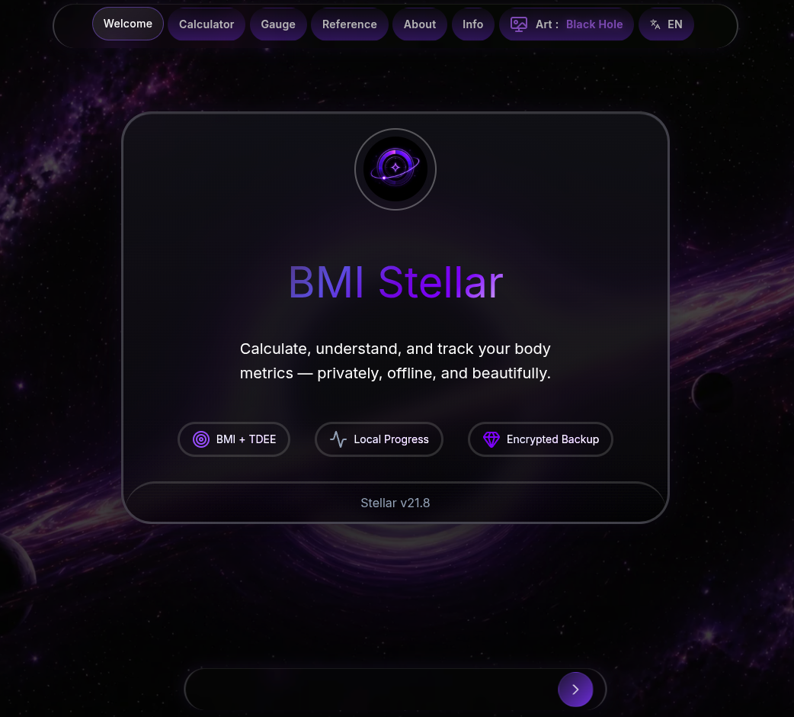
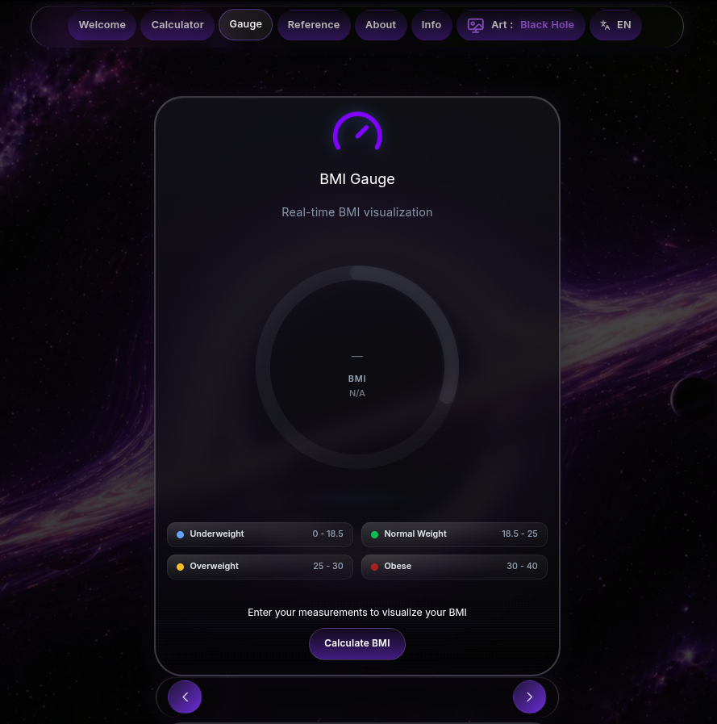
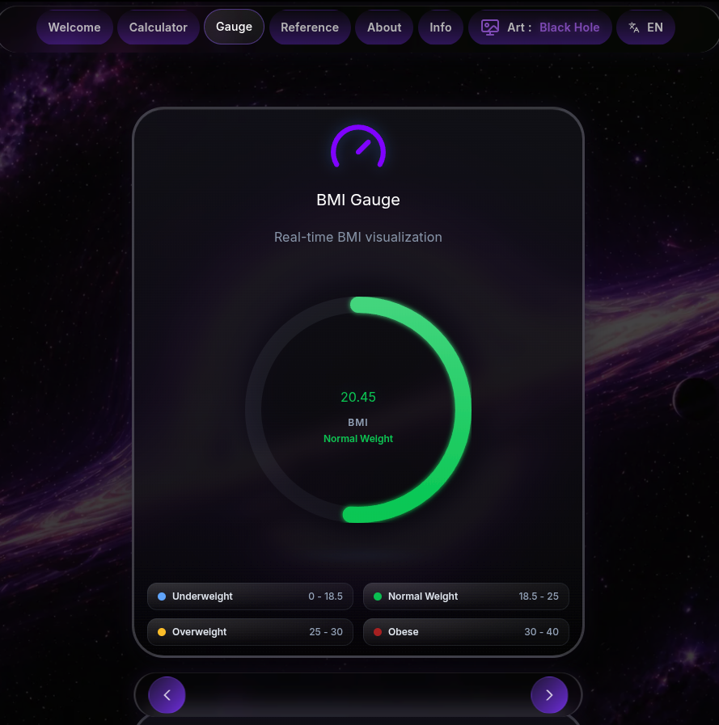
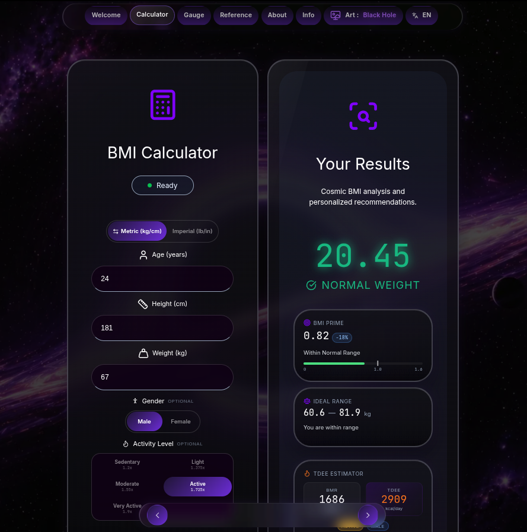
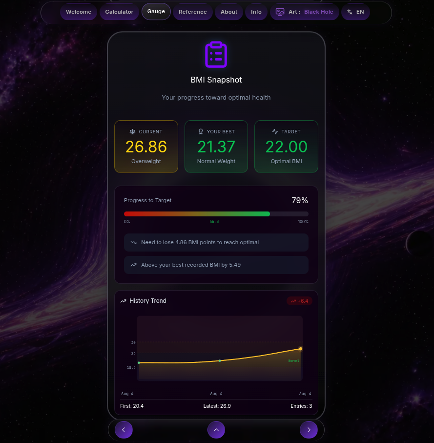

<div align="center">
  

  <h1>bmi</h1>

  <p>
    <strong>A serious privacy-first health metrics application for local BMI, TDEE, body-fat, and progress analysis.</strong>
  </p>

  <p>
    Designed for local-first measurement, encrypted backups, multilingual reporting, and accessible long-term tracking.
  </p>

  <p>
    <a href="https://ko-fi.com/rezky">
      
    </a>
  </p>
</div>

## Demo

<p align="center">
  
</p>

<p align="center">
  
  <br>
  
  <br>
  
  <br>
  
</p>

## Contents

- [Overview](#what-it-does)
- [Tech Stack](#tech-stack)
- [Quick Start](#quick-start)
- [Core Scripts](#core-scripts)
- [Project Layout](#project-layout)
- [Documentation](#documentation-map)
- [Versioning](#versioning)
- [Security](#security-model)
- [Contributing & Releases](#contributing--releases)
- [Support](#support)
- [License](#license)

---

## What It Does

BMI Stellar is a comprehensive, privacy-first health metrics application that runs in your browser. No accounts, no cloud profile, no server-side health database — your BMI history stays on your device unless you explicitly export or share it.

- **Comprehensive Metrics:** Calculates BMI, category classification, BMI Prime, ideal weight range, and personalized health guidance — all computed locally.
- **TDEE Estimation:** Total Daily Energy Expenditure estimator with gender-aware inputs, five activity levels, and context-aware kcal/day display.
- **Body-Fat Estimation:** Gender-specific body-fat percentage estimation using Navy and BMI-based methods.
- **Progress Tracking:** BMI history with interactive trend charts, goal tracking against target weight, and directional indicators.
- **Premium Share Cards:** Generates 1080x1080 Canvas-rendered PNG cards with a premium frame, mini gauge, category scale, and i18n-safe text for social sharing or direct download.
- **Encrypted Backups:** AES-256-GCM encryption with Argon2id key derivation, SHA-256 integrity checksums, and zero-knowledge passphrase verification. Legacy PBKDF2 imports supported.
- **Multilingual:** Native support for English, Indonesian, Japanese, and Chinese with universal unit symbols (kg, cm, lb, in, kcal) across all locales.
- **Offline PWA:** Installable Progressive Web App with service worker, offline support, and Web Vitals monitoring.
- **Accessibility First:** Keyboard-visible focus states, ARIA dialog/radiogroup patterns, semantic status regions, and `prefers-reduced-motion` support.
- **Performance Adaptive:** Three-tier animation system (high/medium/low), strict touch intent detection, and mobile-specific visual simplification for smoother real-device scrolling.

> [!TIP]
> For the full architectural deep dive — CSS cascade, encryption internals, pager navigation, animation tiers — see [Furthermore Documentation](docs/furthermore.md).

## Tech Stack

| Layer          | Technology                                                     |
| -------------- | -------------------------------------------------------------- |
| **Framework**  | SvelteKit 2 + Svelte 5 Runes (`$state`, `$derived`, `$effect`) |
| **Language**   | TypeScript (strict mode)                                       |
| **Runtime**    | Bun                                                            |
| **Styling**    | 18-file modular CSS cascade with custom properties             |
| **Encryption** | `@noble/hashes` (Argon2id, pure JS, no WASM) + Web Crypto API  |
| **Icons**      | Lucide Svelte                                                  |
| **Fonts**      | Inter Variable + JetBrains Mono Variable                       |
| **Tests**      | Vitest + Testing Library (452 tests, 29 suites)                |
| **Deployment** | Vercel (adapter-vercel)                                        |

## Quick Start

```bash
# Clone the repository
git clone https://github.com/oxyzenQ/bmi.git
cd bmi

# Install dependencies
bun install

# Start the development server (with HMR)
bun run dev
```

Open the local URL printed in your terminal (usually `http://localhost:5173`).

## Core Scripts

| Command                                          | Description                                                           |
| ------------------------------------------------ | --------------------------------------------------------------------- |
| `bun run dev`                                    | Start local dev server with HMR                                       |
| `bun run check`                                  | Svelte and TypeScript diagnostics                                     |
| `bun run lint`                                   | ESLint with Svelte plugin                                             |
| `bun run test`                                   | Vitest in watch mode                                                  |
| `bun run test:run`                               | Single test run                                                       |
| `bun run test:ci`                                | CI-friendly test run (forked, 2 workers)                              |
| `bun run test:fast`                              | Fast test run (excludes crypto/history-io)                            |
| `bun run build`                                  | Production build                                                      |
| `bun run format`                                 | Prettier auto-format                                                  |
| `bun run format:check`                           | Prettier check (no write)                                             |
| `bun run verify`                                 | Full local gate: format + 4 audits + check + lint + test:run + build  |
| `./scripts/build.sh check-all`                   | Gatekeeper mirroring CI (same as `verify` + `audit:deps` + `test:ci`) |
| `bun run lint:fix`                               | ESLint auto-fix                                                       |
| `bun run clean`                                  | Remove `.svelte-kit`, `build`, `dist`, `node_modules/.cache`          |
| `bun run audit:deps`                             | `bun audit` dependency vulnerability scan                             |
| `bun run test:crypto`                            | Run only crypto + history-io test suites                              |
| `bun run bmi-update-version <version>`           | Sync version across all canonical files                               |
| `bun run bmi-update-version --dry-run <version>` | Preview a version update without writing                              |

## Project Layout

```txt
src/
├── lib/
│   ├── components/          # UI components (forms, modals, gauges, charts)
│   │   ├── sections/        # Page-level sections (Settings, About)
│   │   ├── form/            # Form sub-components (inputs, toggle, actions)
│   │   ├── encryption/      # Encryption modal sub-components
│   │   └── page/            # Pager controls and gauge section
│   ├── utils/               # Core logic (BMI, crypto, storage, sharing, scroll)
│   ├── i18n/                # Locale engine + 4 translation dictionaries
│   ├── stores/              # PWA install/update state
│   ├── actions/             # Svelte actions (portal)
│   ├── types/               # TypeScript type definitions
│   └── ui/                  # Shared UI primitives (Hero)
├── styles/                  # 18-file modular CSS cascade
├── routes/                  # SvelteKit pages (+layout, +page, +error)
├── service-worker.ts        # PWA service worker
scripts/                     # build.sh gatekeeper + audit scripts (loc, headers, branding, pwa-offline, version-sync)
docs/                        # Long-form documentation (furthermore.md)
.github/workflows/           # CI, release, security, maintenance, docs-ci, runtime-probe
```

## Documentation Map

| Document                                           | Purpose                                                                 |
| -------------------------------------------------- | ----------------------------------------------------------------------- |
| [CHANGELOG.md](CHANGELOG.md)                       | Release history v20.0 → v21.7 with categorized changes per release      |
| [docs/furthermore.md](docs/furthermore.md)         | Architecture deep dive: CSS cascade, pager, crypto, PWA, share image    |
| [docs/AUDIT-2026-08.md](docs/AUDIT-2026-08.md)     | Source code audit report (stale code, potential bugs, cleanup plan)     |
| [DORMANT.md](DORMANT.md)                           | Wake-up checklist for long quiet periods and future maintenance         |
| [.github/CONTRIBUTING.md](.github/CONTRIBUTING.md) | Contributor workflow, coding standards, i18n, PR checklist              |
| [.github/RELEASE.md](.github/RELEASE.md)           | Release checklist, tag rules, artifacts, rollback, troubleshooting      |
| [SECURITY.md](SECURITY.md)                         | Vulnerability reporting, threat model, crypto details, privacy boundary |

## Versioning

The canonical version lives in `package.json` and is synchronized into display documents via `scripts/bmi-update-version.ts`.

> [!IMPORTANT]
> Always use `bun run bmi-update-version <version>` to update the version. This keeps `package.json`, `README.md`, and the dormant maintenance capsule synchronized. Never edit release version strings manually.

Release tags follow the format `Stellar-v<major>.<minor>` (for example, `Stellar-v21.0`). The tag's major/minor pair must match `package.json` (for example, `21.0.0` -> `Stellar-v21.0`).

## Security Model

- **Local First:** Health inputs and history remain on your device. The hosted demo may load Vercel Analytics and Speed Insights for aggregate product/performance telemetry, but BMI values and history are not sent to an app backend.
- **AES-256-GCM Encryption:** Encrypted backups use authenticated encryption with a random 12-byte IV.
- **Argon2id Key Derivation:** OWASP-recommended KDF (64 MiB memory, 3 iterations) — highly resistant to GPU cracking.
- **Zero Knowledge:** Passphrases are never stored, cached, or transmitted. Verification uses encrypted verifier ciphertext only.
- **Legacy Support:** PBKDF2 (600,000 iterations, SHA-256) backup imports remain supported for older exports.
- **Integrity:** SHA-256 checksums verify backup data against tampering.

See [SECURITY.md](SECURITY.md) for the full security policy and vulnerability reporting process.

## Contributing & Releases

Contributions should preserve BMI calculation correctness, privacy boundaries, mobile smoothness, and the existing dark premium identity. Before opening a PR, run the gatekeeper:

```bash
./scripts/build.sh check-all
```

This mirrors the GitHub Actions `ci.yml` workflow end-to-end (format + 5 audits + type-check + lint + test:ci + build). `bun run verify` is the lighter local variant (same steps except `audit:deps` and uses `test:run` instead of `test:ci`).

Use [.github/CONTRIBUTING.md](.github/CONTRIBUTING.md) for development standards and [.github/RELEASE.md](.github/RELEASE.md) for release operations.

## Support

BMI Stellar is an open-source passion project built and maintained independently.

If this project has helped you, inspired your own application, or saved you development time, consider supporting future maintenance:

[](https://ko-fi.com/rezky)

_Support is completely optional, and the project will forever remain open-source._

## License

Distributed under the GPL-3.0 License. See [LICENSE](LICENSE) for more information.
