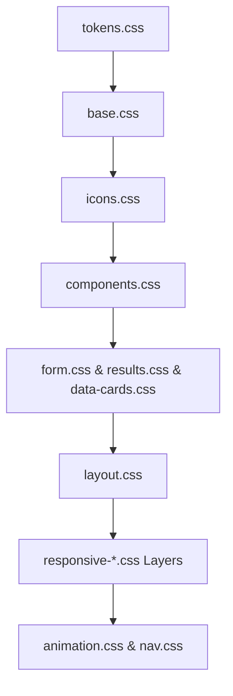
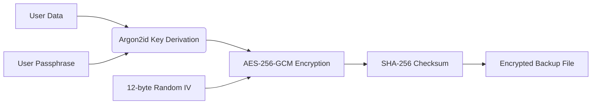

# 📚 BMI Stellar Further Documentation

This document serves as the architectural and technical deep dive into the BMI Stellar application. It is intended for contributors, maintainers, and those curious about the inner workings of the platform.

---

## 📑 Table of Contents

- [Highlights](#-highlights)
- [CSS Architecture](#-css-architecture)
- [Pager Navigation](#-pager-navigation)
- [Lazy Loading](#-lazy-loading)
- [Data Persistence](#-data-persistence)
- [Encryption System](#-encryption-system)
- [Internationalization](#-internationalization)
- [Share Image Generation](#-share-image-generation)
- [CI/CD Workflows](#-cicd-workflows)
- [Release Process](#-release-process)
- [Known Constraints](#-known-constraints)

---

## ✨ Highlights

- **Instant Insights:** Immediate BMI results with precise category classification, health advice, BMI Prime, ideal weight range, and body-fat estimates.
- **TDEE Estimator:** Comprehensive Total Daily Energy Expenditure estimator with a gender toggle and five activity levels.
- **Goal Tracking:** Advanced goal tracker comparing current, best, and target states.
- **Rich Visuals:** Interactive radial gauges and BMI history sparklines.
- **Secure Backups:** Passphrase-encrypted backups using AES-256-GCM, Argon2id, and robust checksum validation.
- **Global Reach:** Multi-language UI spanning English, Indonesian, Japanese, and Chinese.
- **Performance Optimized:** Custom touch-device mobile scroll policies with simplified visual effects during heavy scrolling interactions.
- **Accessibility & Features:** Keyboard shortcuts, drag-and-drop import, offline PWA support, and Web Vitals monitoring.

## 🎨 CSS Architecture

Styles are meticulously modularized under `src/styles/` and imported in a strict cascade order from `src/routes/+layout.svelte`.



| File | Responsibility |
| --- | --- |
| `tokens.css` | Fonts, colors, spacing, radius, timing, z-index, glass, and semantic tokens |
| `base.css` | Global reset, typography, utility classes |
| `icons.css` | Icon sizing and semantic icon colors |
| `components.css` | Central container surfaces, button system, hero base styles |
| `form.css` | BMI form layout, inputs, validation |
| `results.css` | BMI results card, share/action buttons, empty states |
| `data-cards.css` | Stat grid, TDEE, radial gauge, reference table |
| `layout.css` | About section, wallpaper-related layout, footer |
| `responsive-base.css` | Base responsive contracts and fluid media |
| `responsive-width.css` | Width breakpoints and surface sizing |
| `responsive-height.css`| Height-based compression rules |
| `responsive-backdrop.css`| No-backdrop fallback for unsupported browsers |
| `nav.css` | Top/bottom pager navigation |
| `lang-switcher.css` | Floating language switcher panel |
| `animation.css` | Skeleton loading and micro-interactions |
| `responsive-mobile-perf.css`| Touch-device scroll/tap/rendering overrides |
| `responsive-content.css` | Final correction layer for widths, rhythm, radius, and shadow policy |

## 🧭 Pager Navigation

The application functions as a highly optimized single-page experience segmented into six primary sections. Navigation is supported via:

- Top tabs
- Bottom previous/next controls
- Keyboard arrow keys
- Hash routing
- Wheel navigation (Desktop)
- Strict horizontal swiping (Touch Devices)

> [!NOTE]
> Mobile vertical scrolling remains native. Horizontal navigation is intentionally strict; diagonal or vertical scrolling will not accidentally trigger page transitions.

## ⏳ Lazy Loading

To maintain a blistering fast First Contentful Paint (FCP), heavy components are loaded on-demand as their respective sections enter the viewport.

**Lazy-loaded domains include:**
- BMI form & results
- Radial gauge visualizations
- Health risk and snapshot cards
- Goal tracker system
- Body-fat estimates
- Reference tables

## 💾 Data Persistence

Data remains entirely client-side, managed via specialized storage utilities.

| Storage Key | Purpose |
| --- | --- |
| `bmi.history` | Comprehensive BMI calculation history |
| `bmi.unitSystem` | User metric/imperial preference |
| `bmi.renderMode` | Render quality preference (performance vs visuals) |

> [!TIP]
> The application synchronizes state across tabs where appropriate to ensure a seamless experience.

## 🔒 Encryption System

The backup ecosystem is designed with zero-trust principles.



- **Encryption:** AES-256-GCM with a random 12-byte IV.
- **KDF:** Argon2id serves as the primary key derivation function.
- **Legacy Support:** PBKDF2 SHA-256 is supported for importing older backups.
- **Integrity:** SHA-256 checksums verify data against tampering.
- **Zero Storage:** Passphrases are never stored or cached.

> [!WARNING]
> Users *must* remember their passphrase. By design, there is absolutely no recovery mechanism if a passphrase is lost.

## 🌍 Internationalization

Translations are maintained in `src/lib/i18n/locales/`.

**Supported Locales:**
- English (`en`)
- Indonesian (`id`)
- Japanese (`ja`)
- Chinese (`zh`)

The language switcher component is portaled directly to `document.body` to prevent clipping issues within strict section containers.

## 📸 Share Image Generation

`src/lib/utils/share-image.ts` orchestrates the creation of the BMI share card.

**Design Constraints:**
- Outputs strictly in PNG format.
- Fixed 1080 x 1080 canvas size.
- Premium, minimalistic dark aesthetic.
- Features a dynamic brand gradient title and the canonical app version.
- Ensures all title and metadata text is i18n-safe.

## 🤖 CI/CD Workflows

GitHub workflows are located in `.github/workflows/`.

| Workflow | Purpose |
| --- | --- |
| `ci.yml` | Executes type-checking, linting, tests, and the final build |
| `codeql.yml` | Performs automated security analysis |
| `release.yml` | Orchestrates tagged release artifact publishing |
| `auto-update.yml` | Automates dependency update Pull Requests |
| `self-heal-actions.yml`| Automatically updates minor/patch GitHub Action versions |

## 📦 Release Process

> [!IMPORTANT]
> Never manually edit version strings. Use the dedicated scripts to ensure absolute consistency across the repository.

```bash
bun run bmi-update-version --dry-run <version>
bun run bmi-update-version <version>
bun run check
bun run build
```

Release tags must adhere to the visible version format: `Stellar-v<major>.<minor>`

## 🚧 Known Constraints

- **Backdrop Filters:** Older browsers lacking `backdrop-filter` support fallback to opaque surfaces.
- **Mobile Performance:** Touch devices utilize simpler, dark transparent surfaces in heavy scroll areas to maintain 60fps.
- **Accessibility:** Users with "reduced motion" preferences enabled at the OS level will experience disabled animations, though visual styling is preserved.
- **Security Finality:** Encrypted backups fundamentally cannot be recovered without the user's passphrase.
