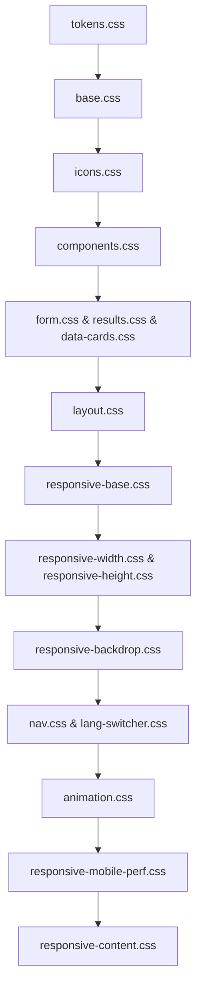
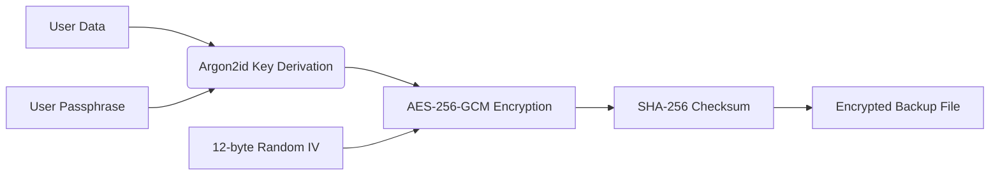

# BMI Stellar — Architectural Deep Dive

This document is the canonical technical reference for BMI Stellar. It covers architecture decisions, internal systems, and design constraints at a depth intended for contributors, security auditors, and maintainers who need to understand _why_ the code works the way it does — not just _what_ it does.

---

## Table of Contents

- [Highlights](#highlights)
- [CSS Architecture](#css-architecture)
- [Accessibility Architecture](#accessibility-architecture)
- [Pager Navigation](#pager-navigation)
- [Animation & Performance Tiers](#animation--performance-tiers)
- [Lazy Loading](#lazy-loading)
- [Data Persistence](#data-persistence)
- [Encryption System](#encryption-system)
- [Internationalization](#internationalization)
- [Share Image Generation](#share-image-generation)
- [Progressive Web App](#progressive-web-app)
- [CI/CD Workflows](#cicd-workflows)
- [Release Process](#release-process)
- [Known Constraints](#known-constraints)

---

## Highlights

- **Instant Insights:** Immediate BMI results with precise category classification, health advice, BMI Prime, ideal weight range, and body-fat estimates — all computed locally with zero network calls.
- **TDEE Estimator:** Comprehensive Total Daily Energy Expenditure estimator with gender toggle and five activity levels (Sedentary, Light, Moderate, Active, Very Active), context-aware captions, and kcal/day display.
- **Goal Tracking:** Advanced goal tracker comparing current, best, and target states with trend sparklines and directional badges.
- **Rich Visuals:** Interactive radial gauge, BMI history sparkline with hover tooltips, and premium share card generation via Canvas API.
- **Secure Backups:** Passphrase-encrypted backups using AES-256-GCM with Argon2id key derivation, SHA-256 integrity checksums, and zero-knowledge passphrase verification.
- **Global Reach:** Multi-language UI spanning English, Indonesian, Japanese, and Chinese — with universal unit symbols (kg, cm, lb, in, kcal) and locale-aware text rendering.
- **Performance Optimized:** Three-tier animation system (high/medium/low) that adapts to device capability, strict touch intent detection, and touch-device CSS that reduces expensive paint work in scroll-heavy views.
- **Accessibility First:** Keyboard-visible focus states, ARIA dialog/radiogroup/alert patterns, keyboard navigation, `prefers-reduced-motion` support, and screen-reader-friendly labels throughout.

## CSS Architecture

Styles are modularized under `src/styles/` and imported in a strict cascade order from `src/routes/+layout.svelte`. The cascade follows a deliberate layering strategy — each layer builds on the previous, with `responsive-content.css` as the ultimate override.



| #   | File                         | Responsibility                                                                                                                                                                    |
| --- | ---------------------------- | --------------------------------------------------------------------------------------------------------------------------------------------------------------------------------- |
| 1   | `tokens.css`                 | Fonts (`@font-face` Inter Variable + JetBrains Mono), colors, spacing, radius, timing, z-index, glassmorphism tokens, deep-void gradients, and all semantic CSS custom properties |
| 2   | `base.css`                   | Global reset, scrollbar hiding, selection color, typography scale, utility classes                                                                                                |
| 3   | `icons.css`                  | Lucide icon fluid sizing via `clamp()`, semantic icon colors                                                                                                                      |
| 4   | `components.css`             | Central glassmorphism containers, button system (6 variants), hero base styles, toast/notify                                                                                      |
| 5   | `form.css`                   | BMI form layout, input validation, pill indicators, autofill fixes, unit system toggle                                                                                            |
| 6   | `results.css`                | BMI results card, share/action/download buttons, empty states, category badges                                                                                                    |
| 7   | `data-cards.css`             | Stat grid, TDEE panel, radial gauge, reference table, goal tracker                                                                                                                |
| 8   | `layout.css`                 | About section, wallpaper layout, footer, disclaimer                                                                                                                               |
| 9   | `responsive-base.css`        | Shared responsive contracts, fluid media, container sizing, form width breakpoints, and component-specific focus contracts                                                        |
| 10  | `responsive-width.css`       | Width breakpoints (768px, ultrawide) and surface sizing                                                                                                                           |
| 11  | `responsive-height.css`      | Height-based compression rules (640px, 520px)                                                                                                                                     |
| 12  | `responsive-backdrop.css`    | `@supports` feature detection for `backdrop-filter`, solid fallback backgrounds                                                                                                   |
| 13  | `nav.css`                    | Pager navigation, bottom controls, performance-tier GPU containment                                                                                                               |
| 14  | `lang-switcher.css`          | Floating language switcher panel (portal-aware global styles)                                                                                                                     |
| 15  | `animation.css`              | Skeleton loading, shooting stars, input focus glow, glass card hover sweeps, progress bars                                                                                        |
| 16  | `responsive-mobile-perf.css` | Touch-device scroll/tap/rendering overrides — disables `backdrop-filter`, simplifies transitions on `(hover: none) and (pointer: coarse)`                                         |
| 17  | `responsive-content.css`     | Final correction layer for widths, rhythm, radius, and shadow policy                                                                                                              |

## Accessibility Architecture

BMI Stellar follows a **component-owned focus pattern**: mouse focus is suppressed (`:focus:not(:focus-visible) { outline: none }`), while keyboard focus is exposed through each component's own visible indicator. Inputs, segmented controls, modal controls, icon buttons, and pager controls use local focus styles rather than a single global purple outline. This keeps keyboard navigation visible without producing inconsistent rings on floating windows or notification controls.

**ARIA patterns in use:**

| Pattern                                               | Components                                                                   |
| ----------------------------------------------------- | ---------------------------------------------------------------------------- |
| `role="dialog"` + `aria-modal="true"` + `aria-label`  | ModalShell, EncryptionModal, LanguageSwitcher, DebugPanel                    |
| `role="radiogroup"` + `role="radio"` + `aria-checked` | UnitSystemToggle, OptionalMetrics (gender + activity), BodyFatEstimate (sex) |
| `aria-invalid` / `aria-disabled` / `aria-busy`        | BmiForm calculate button, input fields                                       |
| `role="alert"`                                        | Validation error messages                                                    |
| `role="status"` + `aria-live="polite"`                | BmiResults (announces calculation results)                                   |
| `aria-current="page"`                                 | Active pager section indicator                                               |
| `role="img"` + `aria-label`                           | Sparkline SVG chart                                                          |
| `aria-hidden="true"`                                  | All decorative icons, dot indicators, spacers                                |

**Reduced motion:** `prefers-reduced-motion: reduce` disables non-functional movement via `animation-config.ts` and CSS media queries. Functional state changes remain available, but decorative motion is removed or reduced.

## Pager Navigation

The application is a single-page experience segmented into six primary sections: Welcome → Calculator → Gauge → Reference → About → Info. Navigation is supported via:

- **Top tabs** — direct section access
- **Bottom prev/next controls** — sequential navigation
- **Keyboard arrow keys** — Left/Right arrows
- **Hash routing** — URL fragment maps to section (`/#calculator`, `/#gauge`)
- **Wheel navigation** — Desktop horizontal wheel gestures with cooldown (520ms), direction threshold (60px dx, max 12px dy), and scroll-state awareness
- **Horizontal swipe** — Touch devices with strict gesture intent detection

> [!NOTE]
> Mobile vertical scrolling remains native. Horizontal navigation is intentionally strict — diagonal or vertical swipes will not accidentally trigger page transitions. The gesture intent system requires 16px of directional movement before committing to horizontal or vertical mode.

**Touch swipe criteria** (`touch-pager.ts`):

- Horizontal dominant (angle ratio > 2.05)
- Minimum swipe distance: 96px
- Maximum gesture duration: 420ms
- Post-navigation cooldown: 520ms
- Vertical intent threshold: 16px
- Vertical scroll cancellation threshold: 28px
- Recent touch-scroll guard: 240ms
- Excluded targets: buttons, links, inputs, labels, and `[role="button"]` elements
- Haptic feedback: 5ms vibration on successful navigation

## Animation & Performance Tiers

`animation-config.ts` implements a three-tier animation system that adapts to device capability at runtime:

| Tier       | Criteria                                           | Marker Duration | Pager Duration | Gauge Tween |
| ---------- | -------------------------------------------------- | --------------- | -------------- | ----------- |
| **High**   | cores >= 8 AND memory >= 8 GiB AND (4g or offline) | 860ms           | 360ms          | 1200ms      |
| **Medium** | cores >= 4 AND memory >= 4 GiB                     | 780ms           | 340ms          | 900ms       |
| **Low**    | everything else                                    | 680ms           | 320ms          | 420ms       |

The default tier is **medium** (applied when hardware APIs are unavailable or during SSR). Navigation styles in `nav.css` apply GPU containment (`contain: layout style paint`) on high-tier devices and disable `backdrop-filter` on low-tier.

All animation constants are `as const` with invariants enforced by tests (e.g., `WHEEL_RECENT_SCROLL_BLOCK_MS < WHEEL_COOLDOWN`).

## Lazy Loading

Heavy components are loaded on-demand as their sections enter the viewport, ensuring a fast First Contentful Paint:

- BMI form and results
- Radial gauge visualization
- Health risk and snapshot cards
- Goal tracker system
- Body-fat estimates
- Reference tables
- Debug panel (dev-only)

The lazy-load utility (`src/lib/utils/lazy-load.ts`) uses `IntersectionObserver` with a small root margin to preload slightly before the section becomes visible.

## Data Persistence

All data remains client-side, managed via a storage abstraction layer (`src/lib/utils/storage.ts`) with localStorage as primary and IndexedDB as secondary:

| Storage Key              | Purpose                                            |
| ------------------------ | -------------------------------------------------- |
| `bmi.history`            | Comprehensive BMI calculation history              |
| `bmi.unitSystem`         | User metric/imperial preference                    |
| `bmi.renderMode`         | Render quality preference (performance vs visuals) |
| `bmi.locale`             | Selected language                                  |
| `bmi.encryptionVerifier` | AES-GCM encrypted passphrase verifier (IndexedDB)  |

> [!TIP]
> The storage layer includes error-resilient fallbacks — `SecurityError`, `QuotaExceededError`, and JSON parse failures are caught gracefully with dev-only warnings. Cross-tab synchronization ensures state consistency when multiple tabs are open.

## Encryption System

The backup ecosystem is designed with zero-trust principles. No passphrase is ever stored or cached.



### Argon2id (Primary KDF)

Parameters follow OWASP 2023 recommendations. Uses `@noble/hashes/argon2.js` — pure JavaScript, no WASM dependency, minimal bundle size.

| Parameter     | Production         | Test (CI) |
| ------------- | ------------------ | --------- |
| Memory        | 64 MiB             | 1 MiB     |
| Iterations    | 3                  | 1         |
| Parallelism   | 1                  | 1         |
| Output length | 32 bytes (AES-256) | 32 bytes  |

### PBKDF2 (Legacy KDF)

Supported for importing older backups. Not used for new encryptions.

| Parameter   | Value              |
| ----------- | ------------------ |
| Iterations  | 600,000            |
| Hash        | SHA-256            |
| Salt length | 16 bytes (128-bit) |

### Encryption Envelope

| Field       | Value                                          |
| ----------- | ---------------------------------------------- |
| Format ID   | `bmi-encrypted-v1`                             |
| Cipher      | AES-256-GCM                                    |
| IV length   | 12 bytes (96-bit)                              |
| Salt length | 16 bytes (128-bit)                             |
| Integrity   | AES-GCM auth tag + SHA-256 ciphertext checksum |

### Passphrase Verification

`enableEncryption()` encrypts a known verifier string with the passphrase and stores the ciphertext in IndexedDB. `verifyPassphrase()` decrypts it — a wrong passphrase triggers AES-GCM auth tag mismatch, returning `false`. The passphrase itself is never stored.

> [!WARNING]
> Users _must_ remember their passphrase. By design, there is absolutely no recovery mechanism if a passphrase is lost.

## Internationalization

Translations are maintained in `src/lib/i18n/locales/` as flat `Record<string, string>` dictionaries with dot-notation keys and `{param}` interpolation.

### Supported Locales

| Code | Language         | Loading                  |
| ---- | ---------------- | ------------------------ |
| `en` | English          | Static import (fallback) |
| `id` | Bahasa Indonesia | Dynamic import           |
| `ja` | Japanese         | Dynamic import           |
| `zh` | Chinese          | Dynamic import           |

### Unit Symbol Policy

All compact numeric contexts use **universal unit symbols** (kg, cm, lb, in, kcal) across every language. Only human-readable labels (Height, Weight, BMI Prime, Ideal Range, TDEE, activity/gender/status labels, recommendations) are translated. This ensures consistent, compact display in the share card and result panels regardless of locale.

### Architecture Details

- **Auto-detection:** `initLocale()` checks localStorage, then `navigator.language` prefix mapping
- **Reactivity:** Svelte writable stores — Svelte 5 components use `$derived($localeVersion)` for locale-change reactivity
- **Fallback chain:** `dicts[currentLocale]` -> `dicts['en']` -> raw key
- **`<html lang>`:** Set dynamically — `zh` maps to `zh-CN`, others map directly
- **Language switcher:** Portaled to `document.body` to prevent clipping within strict section containers

## Share Image Generation

`src/lib/utils/share-image.ts` orchestrates the creation of the BMI share card using the Canvas API.

| Property         | Value                   |
| ---------------- | ----------------------- |
| Canvas size      | 1080 x 1080 px          |
| Output format    | PNG (`image/png`)       |
| Corner radius    | 56px                    |
| Font stack       | `system-ui, sans-serif` |
| Filename pattern | `bmi-stellar-{bmi}.png` |

### Card Structure

1. **Premium frame** — Outer border with gradient stroke (violet-to-highlight), inner sheen line, and radial purple aura
2. **Header** — Brand gradient title with i18n-safe text
3. **BMI value** — 150px bold numeral with category-colored gradient and radial glow
4. **Mini gauge** — Radial arc showing BMI position within 12-42 range
5. **Category pill** — Uppercase label with accent-colored dot indicator
6. **Personal data row** — Height/weight as compact pill badges
7. **Stat cells** — BMI Prime, Ideal Range, and TDEE in pill-shaped cells
8. **Scale bar** — Color-segmented BMI range (UW/NW/OW/OB) with marker dot
9. **Insight box** — Category-specific health advice with left accent bar
10. **Footer** — Branding line, URL, and locale-aware timestamp

### Share Flow

1. Generates canvas -> `canvas.toBlob()` as PNG
2. If `navigator.share` + `canShare({files})` -> Web Share API
3. Else -> creates `<a download>` element -> programmatic click

### CJK Handling

`localeToUpper()` applies `.toUpperCase()` for Latin text but is a no-op for CJK ideographs (U+4E00-U+9FFF), Kana (U+3040-U+30FF), and Hangul (U+AC00-U+D7AF) — these scripts have no case distinction.

## Progressive Web App

| Property    | Value                                                        |
| ----------- | ------------------------------------------------------------ |
| Name        | BMI Stellar — Privacy-First BMI Companion                    |
| Display     | `standalone`                                                 |
| Orientation | `portrait`                                                   |
| Theme color | `#000000`                                                    |
| Categories  | health, fitness, lifestyle, utilities                        |
| Shortcuts   | "Calculate BMI" (`/#calculator`), "View Results" (`/#gauge`) |

The service worker (`src/service-worker.ts`) is registered as an ES module in production only. The PWA install prompt is captured via `beforeinstallprompt` only when a user-facing install affordance can call `prompt()` from a real gesture. Update detection runs automatically after a short delay and only surfaces the refresh notification when version metadata is stable enough to avoid first-load false positives.

## CI/CD Workflows

GitHub workflows are located in `.github/workflows/`.

| Workflow                | Purpose                                                     |
| ----------------------- | ----------------------------------------------------------- |
| `ci.yml`                | Executes type-checking, linting, tests, and the final build |
| `codeql.yml`            | Performs automated security analysis                        |
| `release.yml`           | Orchestrates tagged release artifact publishing             |
| `auto-update.yml`       | Automates dependency update Pull Requests                   |
| `self-heal-actions.yml` | Automatically updates minor/patch GitHub Action versions    |
| `runtime-probe.yml`     | Probes Node/Bun runtime compatibility                       |

## Release Process

> [!IMPORTANT]
> Never manually edit version strings. Use the dedicated scripts to ensure absolute consistency across the repository.

```bash
# Preview changes before applying
bun run bmi-update-version --dry-run <version>

# Apply version update (syncs package.json, README.md, and LICENSE.md)
bun run bmi-update-version <version>

# Verify integrity before tagging
bun run verify
```

Release tags must adhere to the format: `Stellar-v<major>.<minor>` (for example, `Stellar-v21.0`, `Stellar-v22.0`).

## Known Constraints

- **Backdrop Filters:** Older browsers lacking `backdrop-filter` support fallback to opaque surfaces via `responsive-backdrop.css` feature detection.
- **Mobile Performance:** Touch devices utilize simpler, dark transparent surfaces in heavy scroll areas to reduce paint/compositor work. The `responsive-mobile-perf.css` layer disables or softens expensive effects such as `backdrop-filter`, heavy glows, and hover-only transitions on `(hover: none) and (pointer: coarse)` devices.
- **Accessibility:** Users with `prefers-reduced-motion` enabled will experience disabled animations. Visual styling is preserved — only motion is suppressed.
- **Build Environment:** The project targets Node `>=22 <25` and resolves the Bun version from `package.json#packageManager`. CI and release workflows currently run on Node 24.
- **Security Finality:** Encrypted backups fundamentally cannot be recovered without the user's passphrase. This is by design — there is no backdoor.
